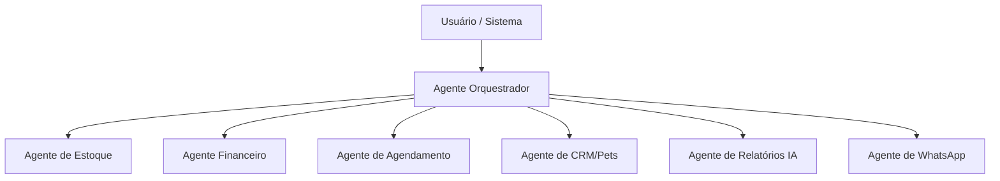

# 09 - IA, Multiagentes e Estratégia de LLM

## Objetivo

Definir como a IA será usada no sistema, quais agentes existirão por módulo, que modelos de LLM usar e como controlar custo de tokens em produção.

---

## Visão Geral de Arquitetura IA



- O **Agente Orquestrador** recebe a intenção (texto ou evento do sistema) e decide qual agente especialista deve ser chamado.
- Cada **agente especialista** tem:
  - System prompt próprio (curto, focado no módulo).
  - Acesso apenas às tabelas/endpoints do seu módulo.
  - Limite de tokens e modelo configurável.

---

## Fases de IA vs Roadmap

A IA será ligada em camadas, acompanhando o roadmap geral:

- **Fase 1 – MVP:** IA mínima, apenas consultas simples usando modelo leve (sem relatórios complexos).
- **Fase 2 – Serviços/CRM:** agentes leves para agenda e CRM de pets (perguntas do dia a dia).
- **Fase 3 – IA avançada:** agente de Relatórios/Insights usando modelo premium sob demanda ou em batch diário.

Esta divisão garante que o sistema já compete com ERPs genéricos (como MarketUP) antes mesmo da IA avançada, e depois passa a oferecer diferenciais que eles não têm.

---

## Agentes Especialistas

### 1. Agente Orquestrador

- **Responsabilidade:** Entender a intenção e rotear para o agente certo ou rejeitar pedidos inválidos.
- **Modelo sugerido:** LLM leve (GPT‑4.1 Nano / Gemini Flash / Sabiazinho 4), pois só classifica e delega.
- **Entradas típicas:**
  - "quais produtos estão em falta?" → Agente de Estoque
  - "quanto vendi hoje?" → Agente Financeiro
  - "remarcar banho do Rex para amanhã" → Agente de Agendamento
  - "clientes que não voltam há 90 dias" → Agente de CRM / Relatórios

### 2. Agente de Estoque

- **Módulo:** definido em `01-modulo-estoque.md` (produtos, movimentações, alertas, venda por peso, balança). [cite:50]
- **Tarefas:**
  - Listar produtos com estoque baixo ou crítico.
  - Listar produtos vencidos ou próximos do vencimento.
  - Ajudar no cadastro de produto (gerar descrição, categoria sugerida, etc.).
- **Modelo sugerido:** LLM leve (Nano/Mini/Sabiazinho) com prompts curtos.

### 3. Agente Financeiro

- **Módulo:** definido em `02-modulo-financeiro.md` (PDV, Pix, caixa, contas, relatórios). [cite:51]
- **Tarefas:**
  - Responder perguntas como:
    - "quanto foi a receita de hoje?"
    - "quais contas vencem esta semana?"
    - "qual o lucro líquido do mês?" (usando DRE simplificada).
  - Gerar pequenos resumos financeiros diários/semanais.
- **Modelo sugerido:** LLM leve para consultas (Nano/Mini/Sabiazinho).
  - Apenas leitura no banco (agente não insere, só consulta/explica dados).

### 4. Agente de Agendamento

- **Módulo:** será implementado na Fase 2 (agenda, serviços, horários, bloqueios). [cite:52]
- **Tarefas:**
  - Criar, remarcar e cancelar agendamentos (seguindo regras de conflito/bloqueio).
  - Listar agenda do dia, por serviço ou por funcionário.
  - Sugerir janelas livres para um determinado serviço.
- **Modelo sugerido:** LLM leve, pois lida com regras simples e consultas estruturadas.

### 5. Agente de CRM/Pets

- **Módulo:** CRM de tutores, pets, histórico clínico e vacinas (Fase 3). [cite:49]
- **Tarefas:**
  - Responder perguntas sobre histórico de um pet ou tutor.
  - Listar clientes inativos há X dias.
  - Listar pets com vacinas vencidas ou a vencer.
- **Modelo sugerido:** LLM leve, com foco em consultas e filtros sobre o banco.

### 6. Agente de Relatórios e IA Avançada

- **Módulo:** Fase 4 (IA e automações). [cite:52]
- **Tarefas:**
  - Gerar relatórios analíticos em linguagem natural:
    - Tendências de receita, ticket médio, produtos/serviços mais vendidos.
    - Análise de churn (clientes que pararam de vir) e causas prováveis.
    - Sugestão de reposição de estoque com base em histórico e sazonalidade.
  - Sugerir campanhas de upsell baseadas no perfil do pet e histórico de serviços.
- **Modelo sugerido:** LLM premium (GPT‑4o / Claude Sonnet / Sabiá 4), chamado **apenas**:
  - Sob demanda (usuário clica em "Gerar relatório inteligente").
  - Em jobs em batch (por exemplo, 1 vez por dia por loja).

### 7. Agente de WhatsApp

- **Módulo:** Integração Evolution API + fluxos de lembretes.
- **Tarefas:**
  - Lidar com respostas simples no WhatsApp (confirmação de horário, dúvidas básicas).
  - Enviar lembretes automáticos de agendamento.
  - Eventualmente, qualificar leads de campanha.
- **Modelo sugerido:** LLM otimizado para PT‑BR (Sabiazinho 4 / Sabiá 4), com prompts curtos e foco em respostas breves.

---

## Estratégia de Custo de LLM

### Princípios gerais

1. **Modelos leves para 90% das operações**
   - Tudo que é CRUD, filtro e resposta direta de dados (estoque, agenda, financeiro do dia, ficha do pet) usa modelos baratos (Nano/Mini/Flash/Sabiazinho).
2. **Modelos premium apenas para análise**
   - Relatórios explicativos, análises de churn, recomendações de ações e textos longos usam modelo premium, e somente sob demanda ou em batch.
3. **Separar planejamento de execução**
   - Quando possível, usar modelo leve para montar a consulta (SQL/endpoint) e deixar o backend executar, em vez de pedir para o modelo fazer tudo.

### Roteamento por complexidade

Exemplos de regra para o Orquestrador:

- Perguntas simples ("listar", "mostrar", "filtrar", "quanto foi hoje") → agente de módulo com modelo leve.
- Pedidos analíticos ("explicar por que", "identificar padrões", "sugerir ações") → agente de Relatórios com modelo premium.

### Redução de tokens

- Manter system prompt de cada agente o mais curto possível (só contexto daquele módulo).
- Cachear prompts fixos (ex.: políticas do pet shop, descrição de campos) sempre que o provedor de LLM suportar.
- Evitar respostas muito longas nas operações do dia a dia (limite de caracteres por resposta nos agentes operacionais).

---

## Exemplo de Configuração de Agentes (YAML)

```yaml
agents:
  orchestrator:
    model: gpt-4.1-mini
    max_tokens: 512
    temperature: 0.2
    modules_allowed: [estoque, financeiro, agendamento, crm, relatórios, whatsapp]

  estoque:
    model: gpt-4.1-nano
    max_tokens: 512
    temperature: 0.1
    permissions: [read:products, read:stock_movements, read:alerts]

  financeiro:
    model: gpt-4.1-nano
    max_tokens: 768
    temperature: 0.1
    permissions: [read:sales, read:expenses, read:cashier, read:reports]

  agendamento:
    model: gpt-4.1-nano
    max_tokens: 512
    temperature: 0.2
    permissions: [read:appointments, write:appointments]

  crm:
    model: sabiá-4
    max_tokens: 768
    temperature: 0.2
    permissions: [read:clients, read:pets, read:pet_history]

  relatorios:
    model: gpt-4o
    max_tokens: 4096
    temperature: 0.3
    permissions: [read:all]
    trigger: [manual, daily_batch]

  whatsapp:
    model: sabiazinho-4
    max_tokens: 256
    temperature: 0.4
    permissions: [send_whatsapp_messages, read_basic_client_data]
```

> Obs.: Os nomes de modelos são exemplos; em produção, serão ajustados para provedores reais (OpenAI, Anthropic, Google, Maritaca, etc.) e para o melhor custo‑benefício no momento.

---

## Pontos de Integração no Backend

- Cada agente pode ser exposto como um endpoint interno, por exemplo:
  - `/ai/orchestrator` – recebe a mensagem/intenção e retorna o roteamento.
  - `/ai/estoque`, `/ai/financeiro`, `/ai/agendamento`, etc.
- O backend controla:
  - Qual modelo chamar.
  - Limites de tokens por requisição e por dia.
  - Logs de chamadas e custos estimados por cliente (para futura cobrança de add-ons de IA).

---

## Próximos Passos

1. Implementar o Agente Orquestrador chamando apenas o Agente de Estoque e Financeiro (MVP IA Fase 1).
2. Adicionar Agente de Agendamento e CRM assim que os módulos estiverem estáveis.
3. Só então ativar o Agente de Relatórios com modelo premium, iniciando com geração de relatório mensal sob demanda.
